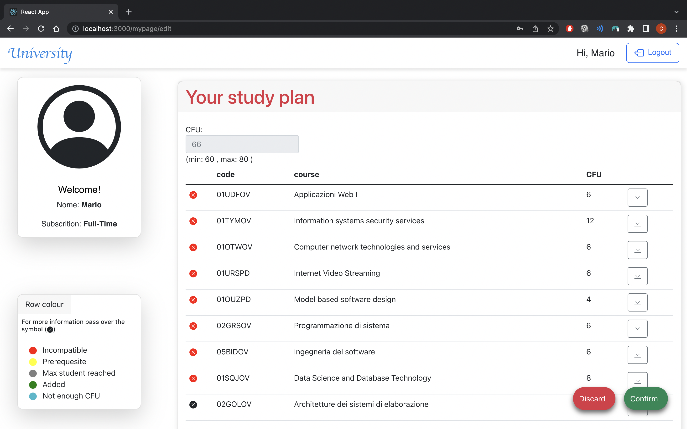
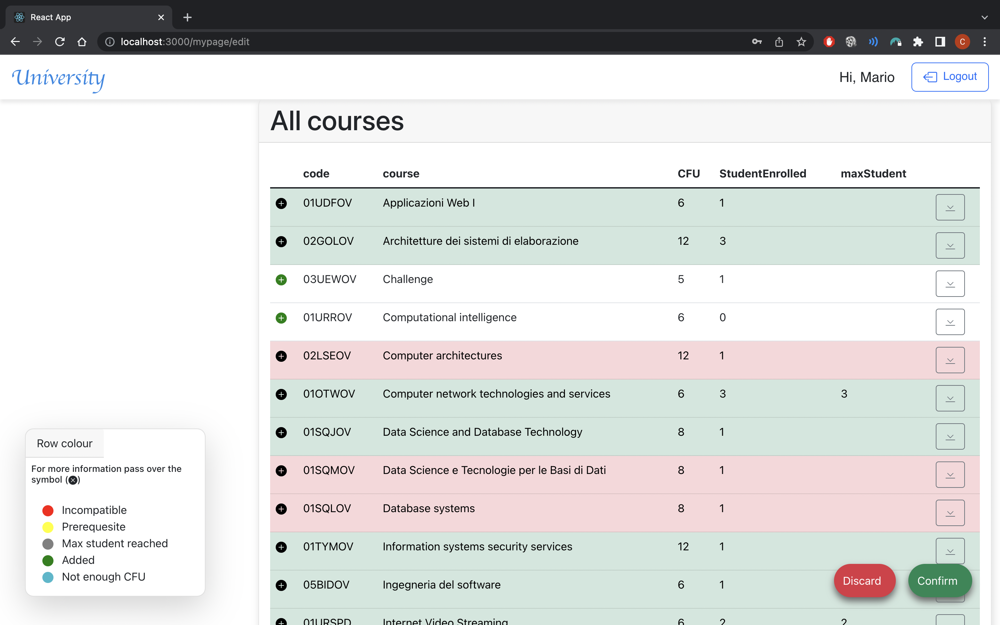

# Exam 1: "Piano studi"
## Student: s295829 ACQUARO CLAUDIO 

## React Client Application Routes

- Route `/`: Here the user will find the list of courses. 
- Route `/login`:Here the user will be able to enter his credentials in the login form and log into the website.
- Route `/home`: Here the user will find the list of courses. 
- Route `/mypage`: This is the landing page after the login. Here, an admin can view his study plans(if exist). If it doesn't exist there's  a button to create a new studyplan. In case a unauthorized user tries to access this page, he is redirected to /login.
- Route `/mypage/edit`: Here the user can modify his study plan

## API Server

#### Get all courses

* HTTP method: `GET`  URL: `/api/courses`
* Description: Get the full list of courses
* Request body: _None_
* Response: `200 OK` (success)
* Response body: Array of objects, each describing one course:

``` json
[
  {
    "code": "02GOLOV",
    "name": "Architetture dei sistemi di elaborazione",
    "CFU": 12,
    "studentEnrolled": 0,
    "maxStudent": NULL,
    "prerequisite": NULL
  },
  {
    "code": "05BIDOV",
    "name": "Ingegneria del software",
    "CFU": 6,
    "studentEnrolled": 0,
    "maxStudent": NULL,
    "prerequisite": "02GOLOV"
  },
  ...
]
```

* Error responses:  `500 Internal Server Error` (generic error)

#### Get incompatbility

* HTTP method: `GET`  URL: `/api/incompatibility`
* Description: Get the code of the courses incompatibile
* Request body: _None_
* Response: `200 OK` (success)
* Response body:

``` json
[
  {
    "codeA": "02GOLOV",
    "codeB": "02LSEOV",
  }
  ...  
]
```

* Error responses:  `500 Internal Server Error` (generic error)

#### Add a new studyPlan

* HTTP method: `POST`  URL: `/api/add/myplan`
* Description: Add a new study plan of the logged user
* Request body:

``` JSON
{
   {
    "code": "02GOLOV",
    "id": 2
  },
  {
    "code": "01SQJOV",
    "id": 2
  
  }
}
```

* Response: `201 OK` (success)
* Response body: the object as represented in the database

* Error responses:  `422 Unprocessable Entity` (values do not satisfy validators), `503 Service Unavailable` (database error)

#### Get study plan

* HTTP method: `GET`  URL: `/api/myplan`
* Description: Get your study plan
* Request body: _None_
* Response: `200 OK` (success)
* Response body:

``` json
[
  {
    "code": "02GOLOV",
    "name": "Architetture dei sistemi di elaborazione",
    "CFU": 12,
    "studentEnrolled": 0,
    "maxStudent": NULL,
    "prerequisite": NULL
  },
  {
    "code": "05BIDOV",
    "name": "Ingegneria del software",
    "CFU": 6,
    "studentEnrolled": 0,
    "maxStudent": NULL,
    "prerequisite": "02GOLOV"
  },
  ...
]
```

* Error responses:  `500 Internal Server Error` (generic error)

#### Update subscrition of a user

* HTTP method: `PUT`  URL: `/api/myplan/sub`
* Description: Update values of the type of subscrition of the logged user
* Request body:

``` JSON
{
    "subscrition": "Part-Time",
}
```

* Response: `200 OK` (success)
* Response body: the object as represented in the database

* Error responses:  `422 Unprocessable Entity` (values do not satisfy validators), `503 Service Unavailable` (database error)

#### Delete study plan

* HTTP method: `DELETE`  URL: `/api/myplan`
* Description: Delete study plan of the logged user
* Request body: _None_

* Response: `204 OK` (success)
* Response body: an empty object

* Error responses:  `503 Service Unavailable` (database error)

#### Update (decrement) enrollment students

* HTTP method: `PUT`  URL: `/api/myplan/dEnroll`
* Description: decrease enrolled students
* Request body: _None_

* Response: `200 OK` (success)
* Response body: the object as represented in the database

* Error responses:  `422 Unprocessable Entity` (values do not satisfy validators), `503 Service Unavailable` (database error)

#### Update (increment) enrollment students

* HTTP method: `PUT`  URL: `/api/myplan/aEnroll`
* Description: increase enrolled students
* Request body: _None_

* Response: `200 OK` (success)
* Response body: the object as represented in the database

* Error responses:  `422 Unprocessable Entity` (values do not satisfy validators), `503 Service Unavailable` (database error)

### User management

#### Login

* HTTP method: `POST`  URL: `/api/sessions`
* Description: authenticate the user who is trying to login
* Request body: credentials of the user who is trying to login

``` JSON
{
    "email": "email",
    "password": "password"
}
```

* Response: `200 OK` (success)
* Response body: authenticated user

``` JSON
{
    "id": 2,
    "email": "mario.rossi@polito.it", 
    "name": "Mario",
    "subscrition": "Full-Time" 
}
```
* Error responses:  `500 Internal Server Error` (generic error), `401 Unauthorized User` (login failed)


#### Check if user is logged in

* HTTP method: `GET`  URL: `/api/sessions/current`
* Description: check if current user is logged in and get her data
* Request body: _None_
* Response: `200 OK` (success)

* Response body: authenticated user

``` JSON
{
    "id": 2,
    "email": "mario.rossi@polito.it", 
    "name": "Mario"
}
```

* Error responses:  `500 Internal Server Error` (generic error), `401 Unauthorized User` (user is not logged in)


#### Logout

* HTTP method: `DELETE`  URL: `/api/sessions/current`
* Description: logout current user
* Request body: _None_
* Response: `200 OK` (success)

* Response body: _None_

* Error responses:  `500 Internal Server Error` (generic error), `401 Unauthorized User` (user is not logged in)

## Database Tables

- Table `user` - contains [ id | email | name | password | salt | subscrition ]
- Table `course` - contains [ code | name | CFU | studentEnrolled | maxStudent | prerequisite ]
- Table `studyplan` - contains [ code | id  ]
- Table `incompatibility` - contains [ codeA | codeB  ]

## Main React Components

- `Home` (in `Home.js`): there is the table with all courses (page unlogged)
- `MyPage` (in `MyPage.js`): user's page with his study plan (if exist) and the list of all courses
- `CourseTable` (inc `CourseTable.js`): the table (generic component) of all courses or your study plan that changes according to your purpose
- `LoginPage` (in `LoginPage.js`): the form in witch the user can be logged

## Screenshot




## Users Credentials

| email | password | name | subscription
|-------|----------|------|-------------
| mario.rossi@polito.it | password | Mario | Full-Time
| paola.ferrari@polito.it | password | Paola | Full-Time
| luca.argentero@polito.it| password | Luca | Part-Time
| chiara.scuro@polito.it| password | Chiara | N/A
| alice.pietra@polito.it| password | Alice | Part-Time
| test@polito.it | password | Test | N/A